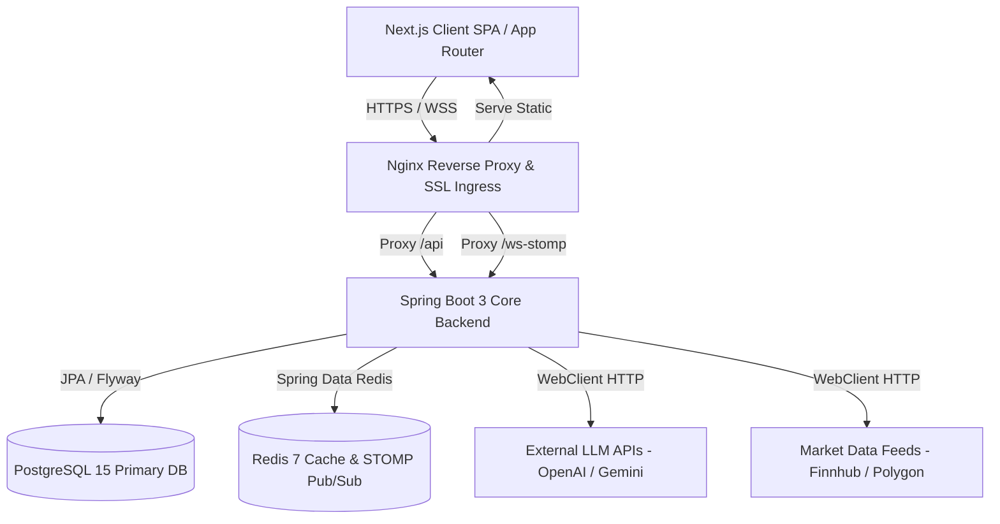
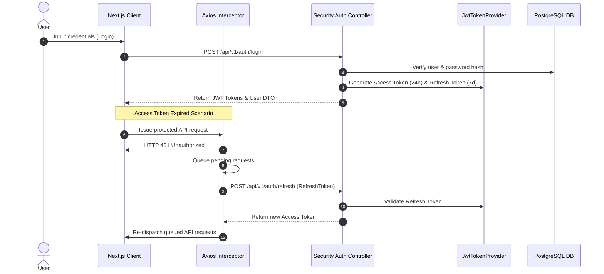
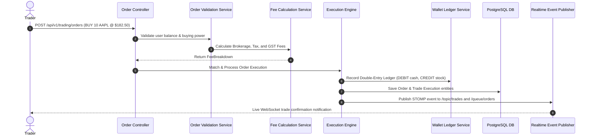
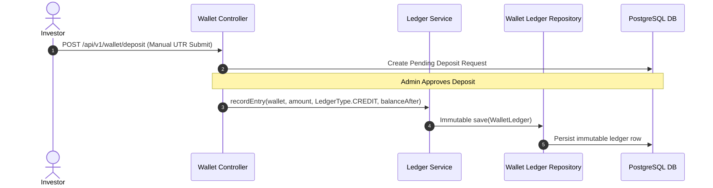
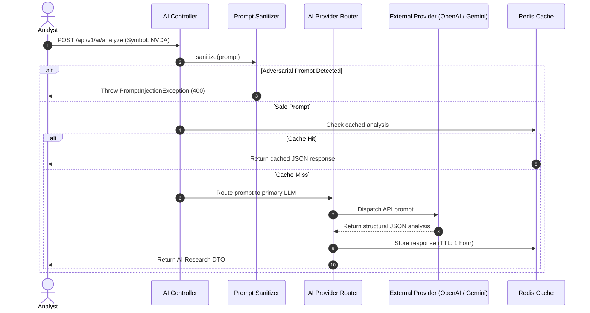

# Enterprise System Architecture Specifications

This document details the architectural design, system context, sequence flows, and microservices readiness of the Stock Market Analysis Platform.

---

## 1. High-Level System Architecture

---

## 2. Authentication & Silent Token Rotation Flow

---

## 3. Order Execution Engine Flow

---

## 4. Double-Entry Treasury & Wallet Engine Flow

---

## 5. AI Quantitative Research Generation Flow

