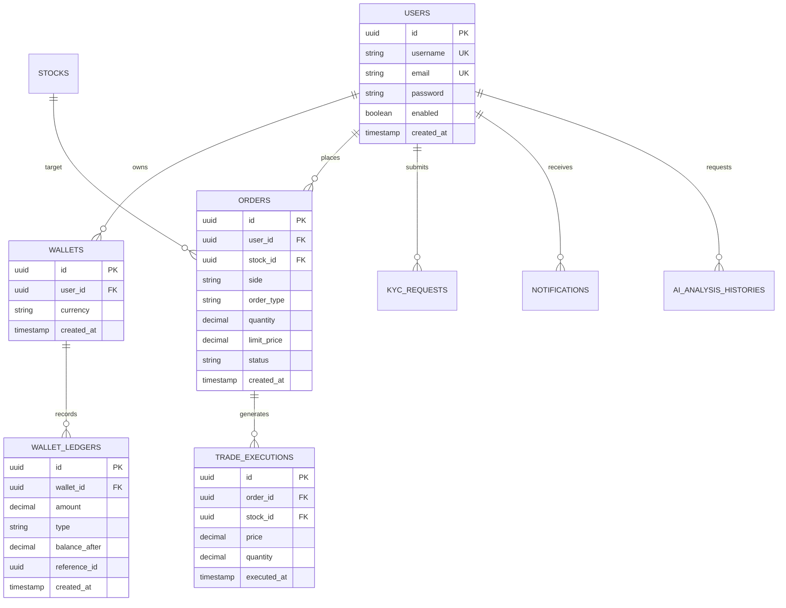

# Database Architecture & Entity Specifications

This document outlines the relational database design, ER diagram, indexing strategy, and soft-delete conventions for the Stock Market Analysis Platform.

---

## 1. Entity-Relationship Diagram (ERD)

---

## 2. Table Specifications & Foreign Keys

### Users Table (`users`)
- Primary Key: `id` (UUID)
- Unique Constraints: `username`, `email`
- Soft Delete Filter: `@SQLRestriction("deleted_at IS NULL")`

### Wallet Ledgers Table (`wallet_ledgers`)
- Primary Key: `id` (UUID)
- Foreign Key: `wallet_id` -> `wallets(id)`
- Fields: `amount`, `type` (`CREDIT` / `DEBIT`), `balance_after`, `description`, `reference_id`

---

## 3. High-Throughput Indexing Strategy

To maintain low latency for financial queries:
- `idx_users_email_username`: Composite index on `users(email, username)` for fast authentication lookups.
- `idx_wallet_ledgers_wallet_created`: Composite index on `wallet_ledgers(wallet_id, created_at DESC)` for instantaneous historical transaction rendering.
- `idx_orders_user_status`: Index on `orders(user_id, status)` for user active order management.
